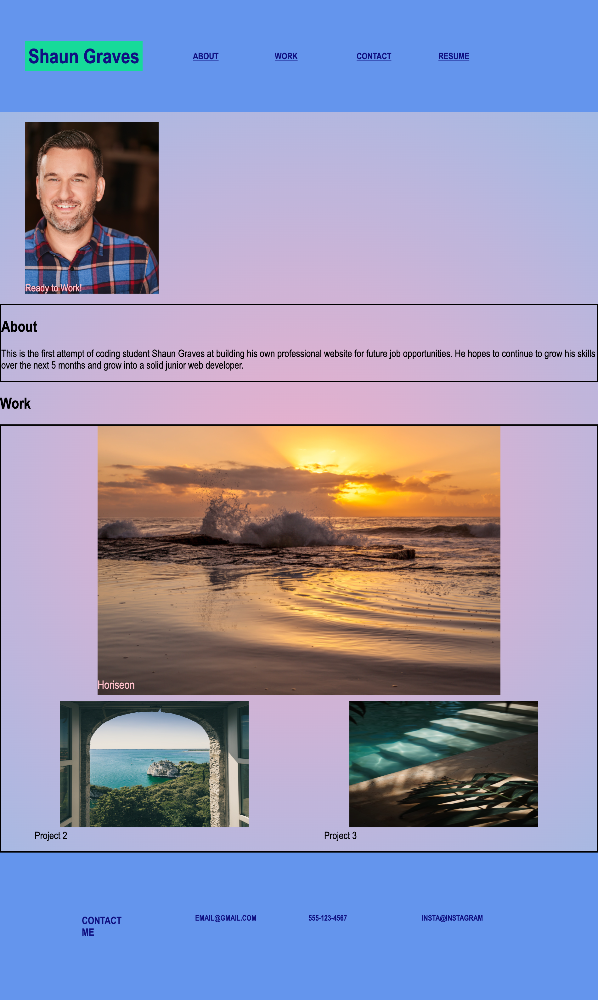

# Shaun Graves Portfolio

# Description
A portfolio to show Shaun Graves professional work.

#Action Steps

- I created my repo in Github.
- I looked over the sample mock up.
- I created my HTML, CSS, and READ.me files.
- I added my name, photo, and links to sections about me, my work, and my contact info.
- I made the image of my first project bigger than the others and added a link connecting the work to the image.
- I added a responsive layout for different devices.
- I completed my README File.
- I made sure my Repository was in good shape and contained necessary files.

## Contact
 -Shaun Graves - shaungrvs@yahoo.com

  -Project Link :
  https://github.com/MemChi24/HWO2-Shaun-Graves-Portfolio

  ## Screenshot

